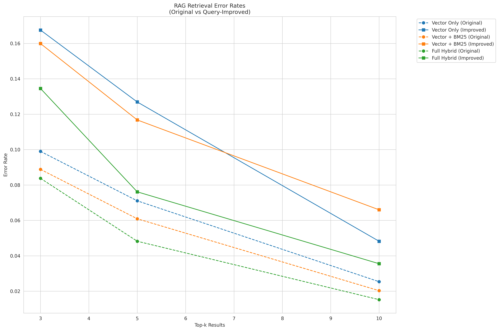

# JoJo RAG - Retrieval Augmented Generation Evaluation Framework

A framework for evaluating and comparing different RAG (Retrieval Augmented Generation) configurations using hybrid search approaches.

## Features

- Hybrid vector search combining dense embeddings, BM25, and cross-encoder reranking
- LLM-powered query improvement
- Comprehensive evaluation framework
- Support for multiple model providers (OpenAI-compatible API)
- Configurable search parameters and model settings
- File processing with intelligent text chunking
- Web interface using Streamlit

## Project Structure

```
.
├── src/
│   ├── chat/
│   │   ├── chatbot.py      # Chatbot implementation with LLM integration
│   │   ├── chat_history.py # Chat history management
│   │   └── config.py       # Chat configuration settings
│   ├── db/
│   │   ├── hybrid_db.py    # Hybrid search database implementation
│   │   ├── file_db.py      # File database management
│   │   └── config.py       # Database configuration
│   ├── text_splitting/     # Text chunking functionality
│   │   ├── text_chunker.py # Token-based text splitting
│   │   └── __init__.py     # Module initialization
│   ├── parser/
│   │   ├── processor.py    # File processing pipeline
│   │   ├── file_parser.py  # File type parsing
│   │   └── __init__.py     # Module initialization
│   ├── prompts/
│   │   ├── search.py       # Search-related prompts
│   │   ├── reasoning.py    # Reasoning-related prompts
│   │   └── __init__.py     # Module initialization
│   └── tool/
│       └── search_tools.py # Search tool implementations
├── data/                   # QA pairs in conversation format
│   ├── economy_knowledge.json
│   ├── glossary_of_crypto_jargon1.json
│   ├── market_analysis.json
│   ├── smart_money.json
│   └── trading_knowledge.json
├── image/                  # Visualization assets
│   └── finance_rag.drawio.png
├── uploads/               # Directory for uploaded files
├── app.py                 # Streamlit web interface
├── config.py             # Environment configuration
├── main.py               # CLI application
├── rag_eval.py           # Evaluation script
├── rag_eval_results.png  # Latest evaluation results
├── rag_eval_results_prev_rephrased.png  # Previous results
└── requirements.txt      # Project dependencies
```

## Evaluation Results

The framework generates detailed performance visualizations comparing different RAG configurations:


The plot shows error rates for different search configurations:
- Vector Search Only
- Vector + BM25
- Full Hybrid (Vector + BM25 + Reranking)

Each configuration is evaluated with both original and LLM-improved queries across different k values (number of retrieved results).

### Result Analysis

1. **Impact of k Value on Error Rate**
   - As k increases, error rates consistently decrease across all configurations
   - This correlation is primarily due to the current evaluation method, which only checks if the correct text was retrieved
   - Larger k values naturally increase the chance of including the correct answer
   - For more complex datasets, finding an optimal k would require balancing retrieval accuracy against computational cost

2. **Original vs Rephrased Queries**
   - Unexpectedly, original queries outperformed rephrased versions in this evaluation
   - This is likely due to the simplicity of the current dataset
   - Rephrased queries, while more comprehensive, may retrieve additional context that pushes the exact match further down in the results
   - This suggests the need for more sophisticated evaluation metrics beyond exact matching

3. **Hybrid Search Performance**
   - The addition of BM25 and reranking showed measurable improvements
   - Full hybrid approach (Vector + BM25 + Reranking) consistently achieved better results
   - This validates the effectiveness of combining multiple search strategies

## Installation

1. Clone the repository:
```bash
git clone <repository-url>
cd jojo-rag
```

2. Install dependencies:
```bash
pip install -r requirements.txt
```

3. Set up environment variables:
```bash
export OPENAI_API_KEY="your-openai-api-key"
export MODEL_NAME="gpt-4o" # Default model, can be changed if needed
export API_BASE="https://api.openai.com/v1" # or your API endpoint
```

## Usage

### Running Evaluations

```bash
python rag_eval.py
```

This will:
1. Load QA pairs from the data directory
2. Build databases with different configurations
3. Run evaluations with varying k values
4. Generate performance plots
5. Save query improvements for analysis

### Configuration Options

#### Search Configurations:
- Vector Search Only
- Vector + BM25
- Vector + BM25 + Reranking

#### Parameters:
- `k`: Number of results to retrieve (3-10)
- `use_bm25`: Enable/disable BM25 search
- `use_rerank`: Enable/disable cross-encoder reranking
- `model_name`: LLM model to use (defaults to gpt-4o)
- `temperature`: LLM temperature setting

## Data Format

The system expects QA pairs in conversation format:
```json
{
  "messages": [
    {
      "role": "user",
      "content": "question"
    },
    {
      "role": "assistant",
      "content": "answer"
    }
  ]
}
```

## Evaluation Metrics

- Error Rate: Percentage of queries where correct answer wasn't retrieved
- Success Rate: Percentage of queries where correct answer was retrieved
- Best k: Optimal number of results to retrieve
- Query Improvements: Analysis of LLM query reformulation

## Implementation Details

### Database
- Uses Qdrant for vector search
- Stores only answers (not questions) in the database
- Supports hybrid search with configurable weights

### Query Processing
1. Original question → LLM for query improvement (using gpt-4o)
2. Improved query → Hybrid search
3. Retrieved results compared with correct answer

### Search Tools
- `document_search`: Hybrid search through the database
- `web_search`: DuckDuckGo integration
- `web_scrape`: Web content extraction

## Known Issues/Limitations

1. Exact match comparison for answers (no semantic similarity)
2. No caching for LLM calls
3. Limited to OpenAI-compatible APIs
4. Single-process evaluation (can be slow for large datasets)

## Future Improvements

1. Add semantic similarity scoring for answer matching
2. Implement caching for LLM and embedding calls
3. Add parallel processing for evaluations
4. Add more evaluation metrics (MRR, NDCG)
5. Add test coverage
6. Add support for more model providers

## Contributing

1. Fork the repository
2. Create your feature branch
3. Commit your changes
4. Push to the branch
5. Create a Pull Request

## License

[Your License Here] 